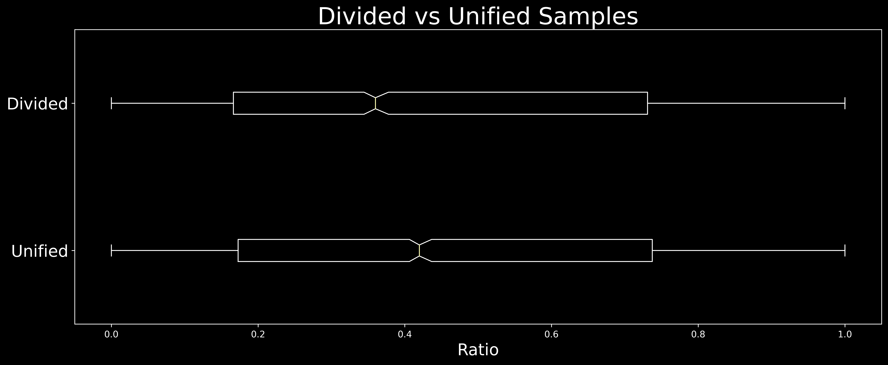
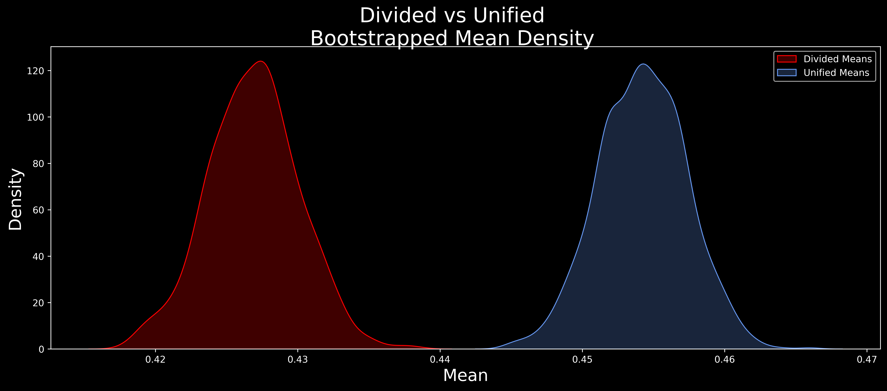

# Crossing the Aisle: an EDA on Congressional Bipartisanship

An EDA regarding bipartisanship in the American federal Congress.
Includes development of a metric for comparing strength of bipartisanship
per vote and initial hypothesis testing utilizing American federal data.

## Rationale

[Research
suggests](https://www.dartmouth.edu/~seanjwestwood/papers/Westwood2020.pdf)
that American voters respond positively policy positions that claim
bipartisan support.  Furthermore, voters are likely adjust their opinion
of and increase their willingness to support legislation if claims are
framed in bipartisan terms.

There is no standard definition of bipartisanship, and the legislative
process is not well understood by many voters.

[As this Politifact article
suggests](https://www.politifact.com/factchecks/2020/feb/12/veronica-escobar/what-acceptable-measure-bipartisanship/),
it’s difficult to fact check and weigh the merits of a politician’s
assertions. It’s also difficult for a politician to counter spurious
suggestions of bipartisanship with any currently accepted metric.

## Developing a Metric: the Bipartisanship Ratio (BPR)

A metric that takes into account a range of bipartisanship would greatly
assist in analyzing the issue.

The proposed metric, the Bipartisanship Ratio (BPR) would allow us to
calculate the balance of the primary political parties for each
individual roll-call vote in both chambers of Congress.

Methodology:

- Chamber has a Roll Call vote
- Vote (either yea or nay) has a successful outcome
- A ratio of the two primary parties is determined from the
  **successful** votes.

## The BPR at Work: The First Congress (Washington Administration)

Utilizing data from [Voteview's Congressional Roll-Call
Database](https://voteview.com/), we are able to calculate the BPR for
each individual vote during a specific historical congress. Below is a
brief analysis showing the BPR for the 1st Congress under Washington.

Although parties as we know them were only in their nascent stage, UCLA
does classify members of the first congress as being either
Pro-Administration or Anti-Administration.

The thistle bars indicate the BPR for votes during the 1st Congress. Red,
Blue and Green provide the mean, median, and mode BPR respectively.

_rc_votes_copy.png)

## Four Administrations: A Hypothesis Test

The composition of congress often changes during the course of a
president's administration. This change provides an interesting
opportunity: the ability to compare bipartisanship within an
administration.

These four, a balance of two Republican and two Democratic
administrations, present two mutually-exclusive scenarios:

- the party holds both the executive and both chambers of congress
- one party holds the executive and both chambers are held by the
  opposition

| Years   | President & Party |      | Congress | House (D) | House (R) | House (other) | Senate (D) | Senate (R) | Senate (other) | Government is: |
| ------- | ----------------- | ---- | -------- | --------- | --------- | ------------- | ---------- | ---------- | -------------- | -------------- |
| 1947-48 | Truman            | D    | 80th     | 188       | 246       | 1             | 45         | 51         | 0              | divided        |
| 1949-50 | Truman            | D    | 81st     | 263       | 171       | 1             | 54         | 42         | 0              | unified        |
| 1953-54 | Eisenhower        | R    | 83rd     | 213       | 221       | 1             | 47         | 48         | 1              | unified        |
| 1955-56 | Eisenhower        | R    | 84th     | 232       | 203       | 0             | 48         | 47         | 1              | divided        |
| 1993-94 | Clinton           | D    | 103rd    | 258       | 176       | 1             | 57         | 43         | 0              | unified        |
| 1995-96 | Clinton           | D    | 104th    | 202       | 232       | 1             | 46         | 54         | 0              | divided        |
| 2005-06 | Bush, GW          | R    | 109th    | 200       | 234       | 1             | 45         | 55         | 0              | unified        |
| 2007-08 | Bush, GW          | R    | 110th    | 231       | 204       | 0             | 51         | 49         | 0              | divided        |

## Hypothesis

There is a statistically significant difference in congressional
bipartisanship between unified and divided governments.

𝐻0:𝜇1=𝜇2   There is no statistical difference in the means  
𝐻1:𝜇1≠𝜇2    There is a statistical difference in the means

We preselect our alpha as: 𝛼=0.05  

## Methodology & Rationale

- Sample data will be divided in to mutually exclusive categories: four
  Unified years and four Divided years.
- Welch's T test will be employed on the data to determine statistical
  difference
  - Welch's accommodates for possible differences in variance
  - Sample sizes are large enough to accommodate possible non-normal
    distribution

## Box Plot: Divided vs Unified Samples

The box plot indicates that there is a difference between the means of
the two sample distributions.

## Perform Welch's T Test

Welch's T test returned a p value of 7.04∗10−67.04∗10−6, which was well
within our 𝛼=0.05. Bootstrapping would assist in confirming the results.

## Confirm results via Bootstrap method

For each distribution:

- create a sample of 1000 values, randomly chosen from the distribution
  with replacement
- find the mean of this set of 1000 values
- repeat this process, creating a list of 10000 means from each
  distribution

Divided Margin of Error: 0.006423912039799648  

Unified Margin of Error: 0.0061711078795822355

## Conclusions, Next Steps

Although the scale of values is quite fine, Welch's T test allows us to
reject the null hypothesis and shows a statistical difference in the mean
BPR of Divided and Unified governments.

Additionally, the data suggests that a unified government may demonstrate
a slight, but statistically significant, increase in legislative
bipartisanship.

Further research directions include:

- Refining the metric, possibly based upon per capita votes to
  accommodate vote volume differences
- Broadening inquiry into sessions where only one chamber is in
  opposition to the administration
- Training a model to predict mean bipartisanship

## Sources & References

Lewis, Jeffrey B., Keith Poole, Howard Rosenthal, Adam Boche, Aaron
Rudkin, and Luke Sonnet (2020). Voteview: Congressional Roll-Call Votes
Database. <https://voteview.com/>

Mekelburg, M. (2020, February 12). *PolitiFact - What is an acceptable
measure of bipartisanship?* <Www.Politifact.Com>.
<https://www.politifact.com/factchecks/2020/feb/12/veronica-escobar/what-acceptable-measure-bipartisanship/>

Westwood, S. J. (n.d.). *The Partisanship of Bipartisanship: How
Representatives Use Bipartisan Assertions to Cultivate Support*.
<Https://Www.Dartmouth.Edu/>. Retrieved December 4, 2020, from
<https://www.dartmouth.edu/~seanjwestwood/papers/Westwood2020.pdf>
